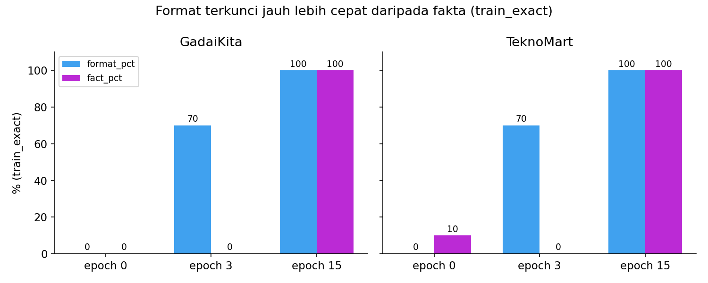
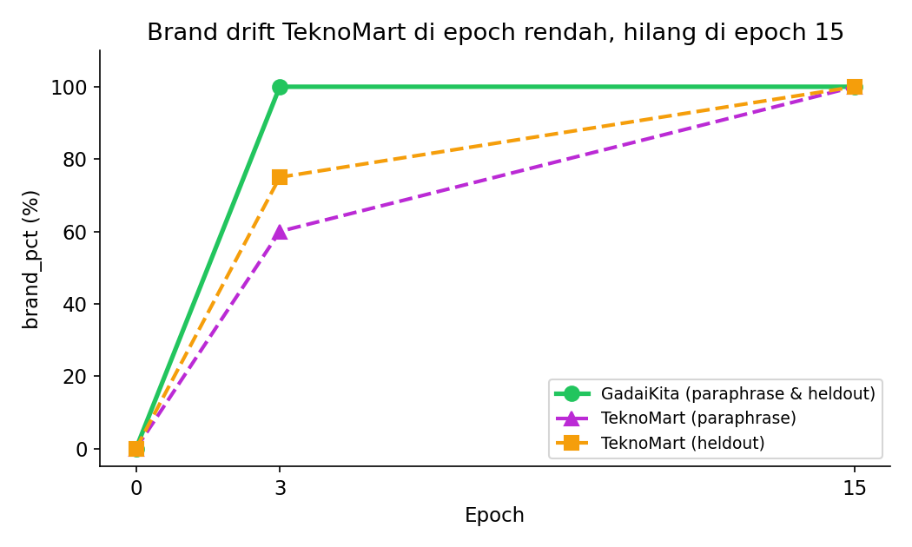

# QLoRA Evaluation Benchmark

Benchmark kecil dan terkontrol untuk melihat apa yang benar-benar dipelajari fine-tuning QLoRA dan seberapa cepat — memakai dua domain customer-service fiktif, prompt held-out, dan sweep epoch pada model 0,5B yang cukup murah untuk dijalankan tiga kali.

Semua angka di bawah berasal dari run nyata di Google Colab. Tidak ada angka yang diestimasi.

## Yang dikerjakan

1. Menghitung jumlah parameter LoRA dan estimasi memori 4-bit secara analitik untuk tiga ukuran model (Qwen2.5-0.5B, LLaMA-7B, Llama-3.1-8B), lalu memverifikasi estimasinya terhadap pengukuran nyata.
2. Membangun dua domain customer-service fiktif (**GadaiKita**, jasa gadai; **TeknoMart**, toko elektronik), masing-masing 10 fakta × 6 variasi kalimat = 60 contoh latih.
3. Membagi evaluasi jadi tiga set per domain: `train_exact` (identik dengan data latih, menguji hafalan), `paraphrase` (makna sama, kalimat baru, menguji generalisasi), dan `heldout` (fakta yang tidak pernah muncul di data latih).
4. Memeriksa tiap jawaban secara otomatis untuk kepatuhan format, nama brand yang benar, kemunculan fakta kunci, dan pengulangan — tanpa perlu baca manual untuk dapat skor.
5. Melatih tiap domain di epoch 0, 3, dan 15 lalu membandingkan hasilnya.
6. Memuat dua adapter LoRA ke satu base model yang sama dan berpindah di antaranya lewat `set_adapter`.

## Hasil

### Format dipelajari jauh lebih dulu dibanding fakta

Di epoch 3, kedua domain sudah menjawab dengan template sapaan/penutup yang benar di prompt `train_exact` — tapi 0% fakta yang benar, bahkan pada pertanyaan yang disalin persis dari data latih:

| Domain | Epoch | `format_pct` (train_exact) | `fact_pct` (train_exact) |
|---|---|---|---|
| GadaiKita | 3 | 70% | 0% |
| GadaiKita | 15 | 100% | 100% |
| TeknoMart | 3 | 70% | 0% |
| TeknoMart | 15 | 100% | 100% |

Fakta jauh lebih susah general dibanding templatenya — di epoch 15, `fact_pct` pada pertanyaan *paraphrase* cuma 40% (GadaiKita) dan 50% (TeknoMart), padahal 100% di pertanyaan literal data latih:



### Brand drift itu nyata, dan bergantung pada jumlah epoch

Di epoch 3, GadaiKita sudah benar 100% menyebut namanya sendiri. TeknoMart belum — sebagian jawaban malah bilang "TeknoSupport" atau "TeknoMart Support":

| Domain | Epoch | `brand_pct` (paraphrase) | `brand_pct` (heldout) |
|---|---|---|---|
| GadaiKita | 3 | 100% | 100% |
| TeknoMart | 3 | 60% | 75% |
| GadaiKita | 15 | 100% | 100% |
| TeknoMart | 15 | 100% | 100% |

Di epoch 15, drift-nya hilang di kedua domain:



### Memori 4-bit: diukur, bukan diasumsikan

| Model | Ukuran FP16 | Estimasi 4-bit | Terukur (cuma Qwen2.5-0.5B) | Rasio |
|---|---|---|---|---|
| Qwen2.5-0.5B | 0,99 GB | 0,46 GB | **0,45 GB** | 2,19x |
| LLaMA-7B (asli) | 13,48 GB | 3,87 GB | — | 3,49x (estimasi) |
| Llama-3.1-8B | 16,06 GB | 5,70 GB | — | 2,82x (estimasi) |

Rasio terukur (2,19x) konsisten dengan estimasinya (2,16x), dan bersama pengukuran langsung di [repo fine-tuning satunya](https://github.com/arielshakaramiro/llama3-qlora-finetuning) pada model 8B, sama-sama tidak mendukung aturan praktis "4x lebih kecil" untuk kuantisasi 4-bit.

## Pengaman kebocoran data otomatis, dan temuan non-monoton yang terbantu terlihat

Setiap pertanyaan `heldout` dan `paraphrase` diperiksa terprogram terhadap data latih sebelum training dijalankan — notebook langsung berhenti dengan `AssertionError` kalau ada tumpang tindih, alih-alih diam-diam menghasilkan skor yang bias. Versi awal benchmark ini punya dua pertanyaan `heldout` yang menyebut nama brand langsung di teks pertanyaannya (misalnya *"Apakah GadaiKita punya cabang di Surabaya?"*), yang membuat model baseline (belum dilatih) bisa dapat skor 50% di `brand_pct` cuma dengan menggemakan pertanyaannya. Pertanyaan itu sudah ditulis ulang tanpa nama brand, dan pengamannya sekarang mengonfirmasi nol kebocoran di setiap run.

Setelah itu diperbaiki, satu temuan lagi terbukti konsisten di run kedua yang independen: `format_pct` TeknoMart pada pertanyaan `heldout` justru **turun** dari 75% (epoch 3) ke 50% (epoch 15), padahal `brand_pct` di set yang sama naik ke 100%. Training loss di epoch 15 sudah sangat rendah (0,33, turun dari 1,55 di epoch 3) — tanda overfitting ke cuma 60 contoh. Satu jawaban di epoch 15 memuat frasa Bahasa Indonesia yang tidak masuk akal ("...berlaku hanya di masa **abat-kata**...") — bukan salah fakta, cuma tidak koheren. Training yang lebih berat mengunci nama brand dengan sempurna sambil merusak koherensi kalimat di prompt yang belum pernah dilihat modelnya.

## Cara menjalankan

1. Buka `notebooks/qlora_hf_stack_evaluation.ipynb` di Google Colab.
2. Set runtime ke GPU (T4 cukup — modelnya cuma 0,5B).
3. Jalankan semua sel dari atas ke bawah. Token Hugging Face opsional.
4. Adapter tersimpan ke Google Drive di `AI-Engineer/LLM/qlora-customer-service/`.

Estimasi total waktu: 10–15 menit.

## Struktur repo

```
.
├── notebooks/
│   └── qlora_hf_stack_evaluation.ipynb
├── images/
│   ├── format_vs_fact.png
│   └── brand_drift.png
├── LICENSE
├── README.md
└── README.id.md
```

## Keterbatasan

- Ini eksperimen skala kecil, satu seed (10 fakta per domain, satu run per setelan epoch) — selisih beberapa persen tidak boleh dibaca sebagai perbedaan yang stabil.
- Pengecekan otomatis (format, brand, kemunculan kata kunci fakta) berbasis kata kunci; jawaban bisa memuat kata kunci yang benar dalam konteks yang salah dan tetap dianggap benar.
- Kedua domain fiktif dan dibuat khusus untuk benchmark ini.

## Lisensi

MIT — lihat [LICENSE](LICENSE).
